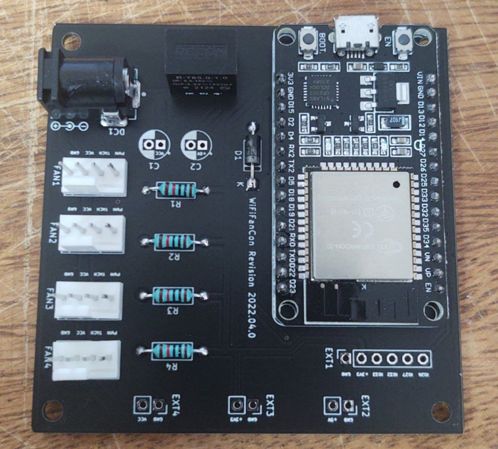
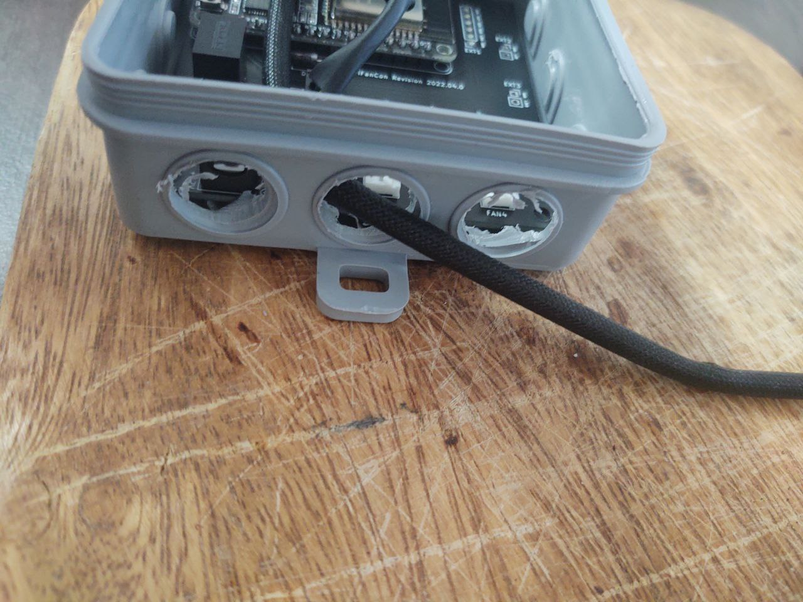
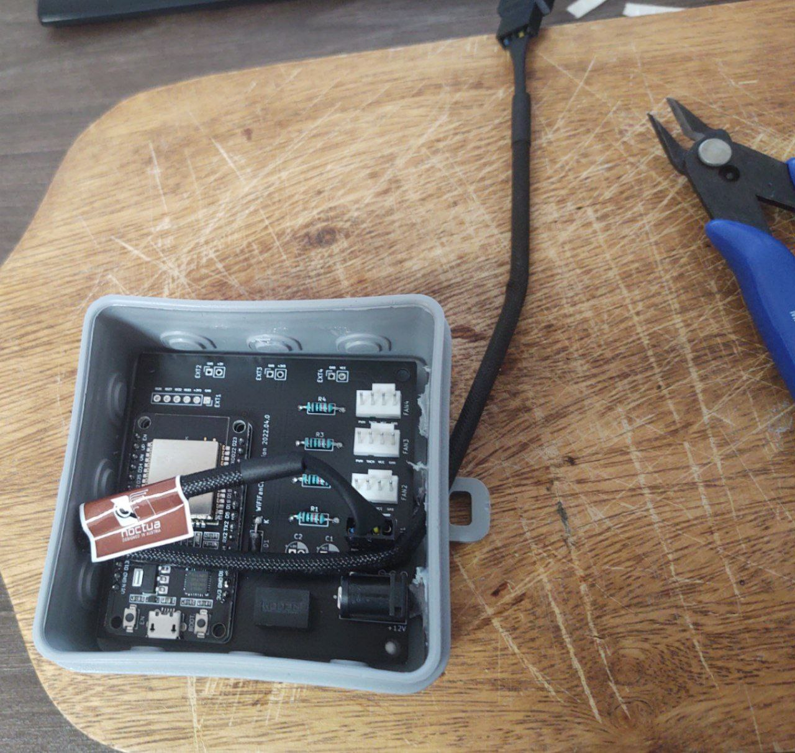
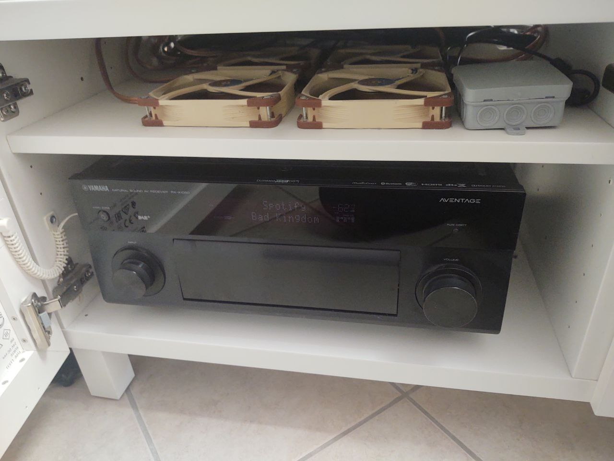

# WiFiFanCon

Control 12V PC Fans via Wi-Fi

## Features

- Control up to four 4-Pin PWM 12V PC Fans via MQTT
- Monitor the Fan Speed
- Optionally extend the system with a temperature probe thanks to the available extension headers
- Very easy THT soldering
- Put it in a safely isolated 45ct junction box and never touch it again
- Do firmware updates via ArduinoOTA
- Admire the silkscreen cat
- ???

## Where?

Head over to the [./pcb](./pcb) and [./firmware](./firmware) folders for the pcb and firmware.

## Why?

I do have quite a few heat-producing devices such as servers or Hi-Fi equipment, which are trapped in whatever
furniture from Ikea barely fit them. This achieves a clean look but also kills the hardware due to insufficient ventilation.

My first solution for this was to add a few very silent 12V Noctua NF-A14 PWM PC Fans and run them at 5V with 33% duty cycle using an Arduino nano.
While that worked just fine, after a year, I've noticed quite a lot of dust buildup on the Fans as well as everything else.

Therefore, I was looking for a way to periodically run the Fans at full speed to blow away whatever dust buildup there might be.
How else would you do that if not via MQTT automated by Home Assistant?

## Pictures?

## How?

As it turns out, the ESP32 offers everything required for such a project.
It has Wi-Fi, it can do 25kHz PWM with more than 4 channels and it is also capable of monitoring the Fan speed.

Furthermore, as it is available as a full devkit PCB, flashing, soldering and everything else is very easy.

Therefore, I basically just needed to design a PCB that features a DC Jack, some Fan Headers and connects everything in a neat package.
Because it is only 70x70mm in size, it perfectly fits into these dirt-cheap german junction boxes, which you can get for 45ct each.

## Why not use something else?

While there are other projects on GitHub achieving similar things, they didn't really 100% fit my requirements, which are:

- Set Fanspeed to x%
- Don't care about temperature
- Show up in home assistant
- Be very easy to solder

## License

This hardware is licensed under the
[Creative Commons Attribution-ShareAlike 4.0 International License][cc-by-sa].

[![CC BY-SA 4.0][cc-by-sa-image]][cc-by-sa]

The software is licensed under the Apache-2.0 license.

[cc-by-sa]: http://creativecommons.org/licenses/by-sa/4.0/
[cc-by-sa-image]: ./img/cc-by-sa.png
