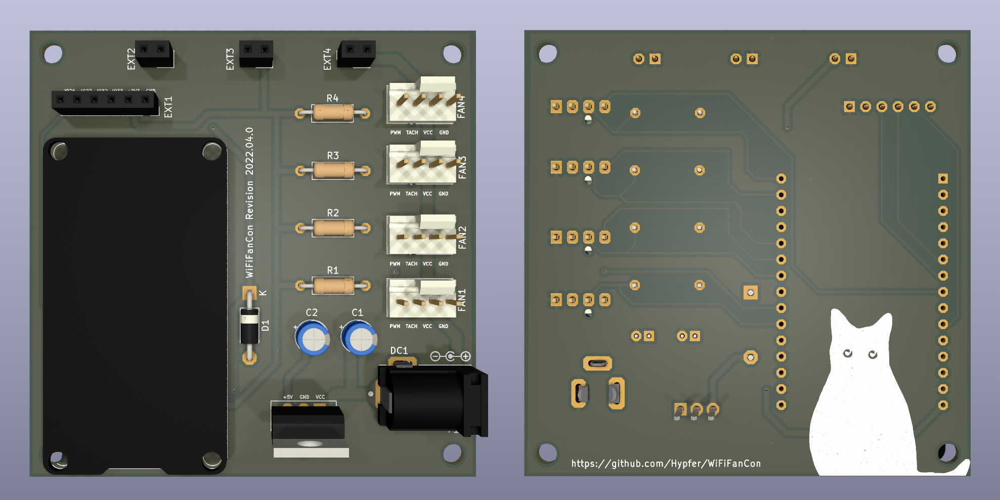

## The Board

Gerber files can be found in the [releases section](https://github.com/Hypfer/WiFiFanCon/releases), but you can also just create them yourself using KiCAD 6

## Required parts

To build one of these you will need:

- 1x ESP32 Devkit.

  There are multiple revisions of this. make sure to get the 30-Pin one where the first pin on the left of the USB connector is labelled VIN.

- 4x 10k Resistor

- 4x 4-Pin PC Fan Header

  I used the Molex 47053-1000

- 1x DC Jack

  The board was designed with the CUI PJ-202BH in mind

- 1x 1N5817 Schottky Diode

  To protect your voltage regulator

- 1x Voltage Regulator 12v -> 5v

  I've used the RECOM R-785.0-1.0, which is very efficient and doesn't require any other components

- 0-2x 10uF 16v or similar cap

  Your voltage regulator might need those

Soldering should be straightforward and easy even for beginners.

I recommend the following order:
1. Resistors
2. Schottky
3. ESP32 Devkit
4. (Caps)
5. Fan Headers
6. DC Jack
7. Voltage Regulator